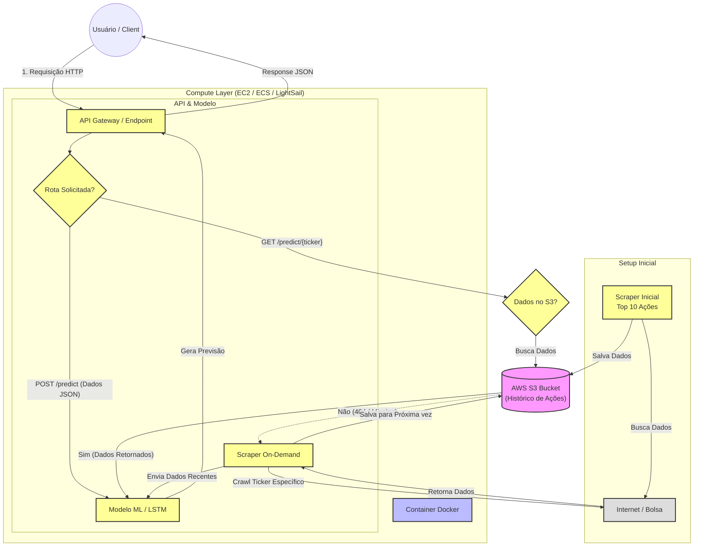

# API de Previsão de Preços de Ações

Sistema completo de previsão de preços de ações usando modelo LSTM (Long Short-Term Memory) com pipeline ETL automatizado e API REST.

## Visão Geral

API que fornece previsões de preços de ações da bolsa brasileira usando machine learning. O sistema busca dados históricos do Yahoo Finance, aplica transformações e features financeiras, e utiliza um modelo LSTM treinado para prever preços futuros.

## Arquitetura



## Estrutura do Projeto

### Módulos Principais

**scapper/scr/extract/yahoo_extractor.py** - Extração de dados do Yahoo Finance

**scapper/scr/transform/price_transformer.py** - Transformação e feature engineering dos dados
- Normalização de colunas
- Criação de features financeiras: retorno diário, médias móveis (20/50 dias), volatilidade
- Limpeza e validação de dados

**scapper/scr/load/parquet_loader.py** - Gerenciamento de persistência (local + S3)
- Sistema híbrido de cache: busca local primeiro, depois S3
- Salvamento de dados brutos e processados

**scapper/scrapper_pipeline.py** - Orquestração do pipeline ETL
- Coordena extração, transformação e carregamento
- Gerencia cache inteligente de dados

**model_executor.py** - Modelo LSTM de previsão
- Modelo com 2 camadas LSTM e 64 neurônios
- Entrada: close + volume (últimos 30 dias)
- Saída: previsão de preço
- Suporta previsão múltipla (recursiva)

**api.py** - API REST usando FastAPI
- Endpoints HTTP para previsões
- Validação de dados com Pydantic
- Logging detalhado

## Instalação

### Requisitos
- Python 3.11+
- Docker (opcional)

### Instalação Local

```bash
pip install -r requirements.txt
```

### Executar API Localmente

```bash
python -m uvicorn api:app --host 0.0.0.0 --port 8000
```

ou

```bash
python api.py
```

A API estará disponível em: http://localhost:8000

Documentação interativa: http://localhost:8000/docs

## Uso da API

### Endpoints Disponíveis

**GET /** - Informações da API e endpoints disponíveis

**GET /health** - Health check do serviço

**GET /predict/{ticker}** - Previsão de preços para um ticker específico

Query parameters opcionais:
- days: quantidade de dias para prever (padrão: 1)
- start_date: data inicial para busca de dados (formato: YYYY-MM-DD)
- end_date: data final para busca de dados (formato: YYYY-MM-DD)

**POST /predict** - Previsão com configuração completa via JSON

### Exemplos de Requisição

Previsão simples de 1 dia:
```bash
curl http://localhost:8000/predict/PETR4.SA
```

Previsão de 7 dias:
```bash
curl "http://localhost:8000/predict/PETR4.SA?days=7"
```

Previsão de 30 dias com período específico:
```bash
curl "http://localhost:8000/predict/VALE3.SA?days=30&start_date=2023-01-01&end_date=2024-12-31"
```

Requisição POST com JSON:
```bash
curl -X POST http://localhost:8000/predict \
  -H "Content-Type: application/json" \
  -d '{"ticker": "ITUB4.SA", "start_date": "2023-01-01", "end_date": "2024-12-31", "days": 5}'
```

### Formato da Resposta

A API retorna um JSON com a seguinte estrutura:
- ticker: código da ação
- predictions: array com previsões para cada dia solicitado
- days: quantidade de dias previstos
- last_known_price: último preço real conhecido
- currency: moeda (BRL)

## Docker

### Build da Imagem

```bash
docker build -t stock-prediction-api .
```

### Executar Container

```bash
docker run -d -p 8000:8000 --name stock-api stock-prediction-api
```

### Verificar Logs

```bash
docker logs -f stock-api
```

### Parar Container

```bash
docker stop stock-api
docker rm stock-api
```

## Docker Compose (Recomendado)

### Iniciar Serviços

```bash
docker-compose up -d
```

### Ver Logs em Tempo Real

```bash
docker-compose logs -f
```

### Parar Serviços

```bash
docker-compose down
```

### Rebuild e Restart

```bash
docker-compose up -d --build
```

## Funcionamento do Sistema

### Fluxo de Previsão

1. Cliente faz requisição HTTP com ticker da ação
2. Sistema verifica cache local, depois S3
3. Se dados não existirem, extrai do Yahoo Finance
4. Aplica transformações e feature engineering
5. Carrega modelo LSTM treinado
6. Gera previsões (recursivas para múltiplos dias)
7. Retorna JSON com previsões

### Cache Inteligente

O sistema implementa cache em duas camadas:
- **Local**: scapper/data/processed/prices/ticker=XXX/
- **S3**: s3://bucket/processed/prices/ticker=XXX/

Isso minimiza chamadas ao Yahoo Finance e melhora performance.

### Previsão Recursiva

Para previsões de múltiplos dias:
- Usa últimos 30 registros históricos
- Prediz dia seguinte
- Adiciona previsão aos dados
- Repete processo para próximos dias

## Configuração AWS S3 (Opcional)

Para habilitar persistência em S3, configure as variáveis de ambiente:

```bash
export AWS_ACCESS_KEY_ID=sua_chave
export AWS_SECRET_ACCESS_KEY=sua_secret
export AWS_DEFAULT_REGION=us-east-1
```

Ou adicione ao docker-compose.yml na seção environment.

## Tickers Suportados

O sistema suporta qualquer ticker disponível no Yahoo Finance, incluindo:
- PETR4.SA (Petrobras)
- VALE3.SA (Vale)
- ITUB4.SA (Itaú)
- BBDC4.SA (Bradesco)
- MGLU3.SA (Magazine Luiza)

Formato: CODIGO.SA para ações brasileiras

## Modelo de Machine Learning

**Arquitetura**: LSTM (Long Short-Term Memory)
**Camadas**: 2 camadas com 64 neurônios cada
**Features de entrada**: close (preço de fechamento) e volume
**Janela temporal**: 30 dias
**Normalização**: MinMaxScaler para features e target

## Monitoramento

Health check endpoint:
```bash
curl http://localhost:8000/health
```

Logs detalhados de todas as operações:
- Requisições recebidas
- Busca de dados (local/S3/Yahoo)
- Execução de previsões
- Erros e exceções

## Troubleshooting

**Erro: ModuleNotFoundError** - Verifique se todas as dependências foram instaladas

**Erro: Ticker não encontrado** - Verifique o formato do ticker (ex: PETR4.SA)

**Erro: Dados insuficientes** - O modelo requer pelo menos 30 dias de dados históricos

**API não responde** - Verifique se a porta 8000 está disponível e o serviço está rodando

## Performance

Tamanho estimado da imagem Docker: 2-3GB (PyTorch e dependências ML)

Tempo médio de resposta:
- Com cache: 2-5 segundos
- Sem cache (primeira requisição): 10-20 segundos

## Limitações

- Previsões recursivas têm acurácia decrescente com o número de dias
- Modelo treinado com dados históricos específicos
- Requer conexão com internet para buscar dados do Yahoo Finance
- S3 opcional, mas recomendado para produção